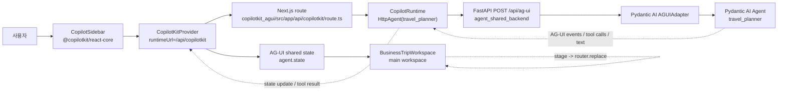
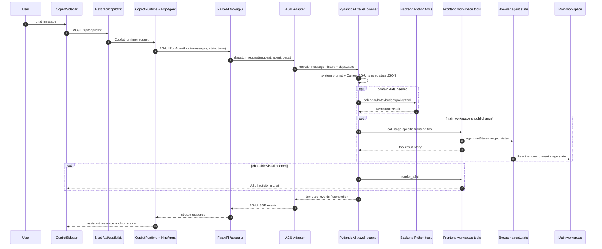
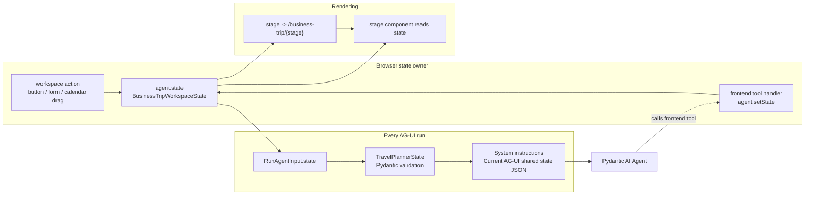
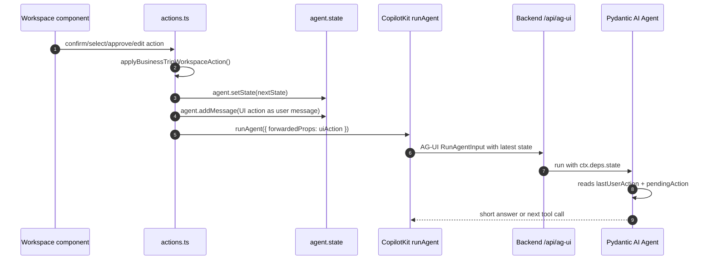
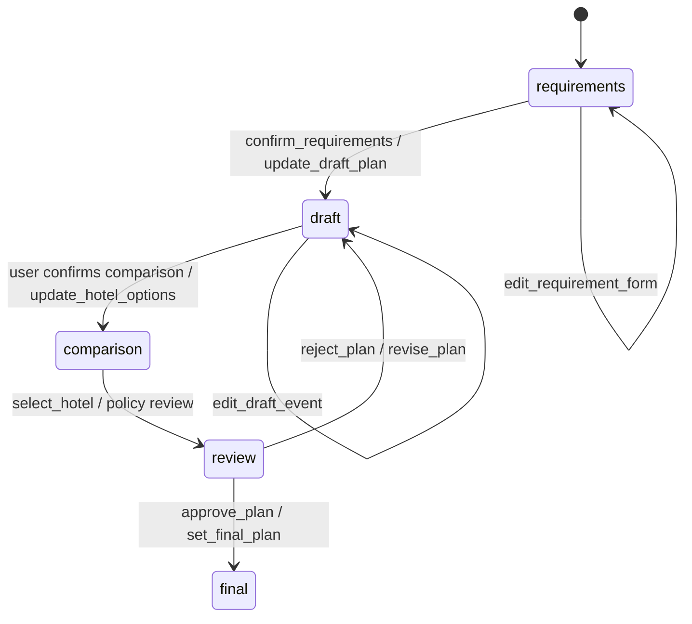

# CopilotKit AG-UI / A2UI Flow

이 문서는 출장 계획 demo에서 chat request, AG-UI endpoint, tool call, shared state, route/component rendering이 어떻게 연결되는지 설명한다.

## 런타임 경계

핵심 경계는 다음과 같다.

- Browser는 `CopilotKitProvider`와 `CopilotSidebar`를 가진다.
- Next.js `/api/copilotkit`은 CopilotKit runtime boundary다. 여기서 `HttpAgent`가 backend `/api/ag-ui`로 AG-UI request를 전달한다.
- Backend `/api/ag-ui`는 실제 demo path다. `AGUIAdapter`가 AG-UI `RunAgentInput`을 Pydantic AI run으로 변환하고, 결과를 다시 AG-UI SSE event로 stream한다.
- Main workspace는 backend가 직접 render하지 않는다. React component가 `agent.state`를 읽고 stage별 화면을 render한다.

## Endpoint 역할

| Endpoint | 위치 | 역할 | UI state/tool 사용 |
| --- | --- | --- | --- |
| `GET/POST /api/copilotkit` | Next.js frontend | CopilotKit runtime single endpoint. Sidebar request를 받고 `HttpAgent`로 backend에 전달한다. | 있음. Browser에서 등록한 frontend tool과 shared state가 이 경로를 통해 AG-UI request에 포함된다. |
| `POST /api/ag-ui` | FastAPI backend | Pydantic AI agent의 실제 AG-UI 실행 경로. `AGUIAdapter.dispatch_request()`가 request를 처리한다. | 있음. `RunAgentInput.state`, message history, frontend tool schema, `render_a2ui`가 들어올 수 있다. |
| `POST /api/chat` | FastAPI backend | backend agent/debug용 plain JSON endpoint. 모델과 Python tool 동작 확인용이다. | 없음. CopilotKit runtime, frontend tool, `render_a2ui`, browser shared state가 없다. |

`/api/chat`으로 호출하면 agent는 Python backend tool만 사용할 수 있다. UI route 변경, main workspace update, chat-side A2UI render 검증은 `/api/copilotkit -> /api/ag-ui` 경로에서만 의미가 있다.

## 전체 요청 흐름

## Tool이 흘러 들어가는 위치

```mermaid
flowchart TB
  subgraph Backend["Backend Pydantic AI tools"]
    Calendar["calendar_check_availability"]
    Hotel["hotel_search_options"]
    Budget["budget_validate_policy"]
    Policy["policy_check_travel_rules"]
  end

  subgraph Frontend["Frontend tools registered in browser"]
    Stage["set_business_trip_stage"]
    Req["update_requirement_form"]
    Draft["update_draft_plan"]
    Options["update_hotel_options"]
    Review["update_policy_checks"]
    Final["set_final_plan"]
    Select["select_hotel_option"]
    Compat["update_travel_workspace"]
    A2UI["render_a2ui<br/>runtime injected"]
  end

  Agent["Pydantic AI travel_planner"]
  State["AG-UI shared state"]
  Chat["CopilotSidebar message area"]
  Workspace["Main workspace"]
  RequestTools["AG-UI RunAgentInput.tools"]

  Agent --> Calendar
  Agent --> Hotel
  Agent --> Budget
  Agent --> Policy
  Calendar --> Agent
  Hotel --> Agent
  Budget --> Agent
  Policy --> Agent

  Stage -. "registered schema" .-> RequestTools
  Req -. "registered schema" .-> RequestTools
  Draft -. "registered schema" .-> RequestTools
  Options -. "registered schema" .-> RequestTools
  Review -. "registered schema" .-> RequestTools
  Final -. "registered schema" .-> RequestTools
  Select -. "registered schema" .-> RequestTools
  Compat -. "registered schema" .-> RequestTools
  A2UI -. "runtime injected schema" .-> RequestTools
  RequestTools -. "available to agent" .-> Agent

  Agent -. "tool call event" .-> Req
  Agent -. "tool call event" .-> Draft
  Agent -. "tool call event" .-> Options
  Agent -. "tool call event" .-> Review
  Agent -. "tool call event" .-> Final
  Agent -. "tool call event" .-> Select
  Agent -. "fallback only" .-> Compat
  Agent -. "chat visual only" .-> A2UI

  Req --> State
  Draft --> State
  Options --> State
  Review --> State
  Final --> State
  Select --> State
  Stage --> State
  Compat --> State
  State --> Workspace
  A2UI --> Chat
```

Backend Python tool은 domain data를 만든다. 이 tool result의 `ui_component` 값은 "어떤 UI에 매핑하면 좋다"는 hint일 뿐, main workspace를 직접 render하지 않는다.

Frontend tool은 browser에 등록된다. Agent가 AG-UI request에서 받은 tool schema를 보고 호출하면, CopilotKit이 browser-side handler를 실행하고 `agent.setState()`로 shared state를 갱신한다.

`render_a2ui`는 chat 안의 A2UI surface를 만들기 위한 runtime-injected tool이다. Main workspace stage route나 React component 상태를 바꾸려면 `render_a2ui`가 아니라 stage-specific workspace tool을 호출해야 한다.

## Shared State 유지 방식

현재 구현에서 shared state의 원천은 browser-side `agent.state`다. Backend DB나 server session에 저장하지 않는다.

State는 두 schema가 mirror한다.

- Frontend: `BusinessTripWorkspaceState` in `copilotkit_agui/src/business-trip/state.ts`
- Backend: `TravelPlannerState` in `agent_shared_backend/src/agents/travel_planner/state.py`

매 run마다 CopilotKit은 현재 `agent.state`를 AG-UI `RunAgentInput.state`에 실어 backend로 보낸다. Backend `TravelPlannerDeps.state`가 Pydantic model로 이를 검증하고, agent instruction에 `Current AG-UI shared state` JSON으로 다시 주입한다.

## UI component action 흐름

Form input처럼 사용자가 값을 입력하는 동작은 즉시 `agent.setState()`만 수행할 수 있다. 이 경우 agent run은 발생하지 않는다. 반면 "다음으로", "호텔 선택", "승인", "반려", "캘린더 event 수정 후 확인" 같은 workflow action은 state를 먼저 반영한 뒤 `runAgent()`를 호출한다.

이 때문에 agent는 단순 chat message뿐 아니라 `lastUserAction`, `pendingAction`, 최신 `draftPlan`, `selectedHotelId`, `approvalStatus`를 보고 "방금 UI에서 무엇이 일어났는지" 판단한다.

## Agent가 실제로 보는 것

AG-UI demo path에서 agent가 보는 입력은 다음이다.

| 입력 | 출처 | 설명 |
| --- | --- | --- |
| System prompt | `system.j2` + client params | workflow rule, confirmation gate, tool 사용 규칙, A2UI/main workspace 경계를 포함한다. |
| Current AG-UI shared state JSON | `agent.py` instructions hook | `ctx.deps.state.model_dump()` 결과가 system instruction 뒤에 붙는다. |
| Message history | CopilotKit `RunAgentInput.messages` | Sidebar 대화와 UI action이 만든 synthetic user message가 포함된다. |
| Backend tools | Pydantic AI `get_tools()` | calendar, hotel, budget, policy mock business logic. |
| Frontend tools | CopilotKit AG-UI request | browser가 `useFrontendTool()`로 등록한 workspace update tools. |
| `render_a2ui` | CopilotKit runtime | chat-side visual rendering용. Main workspace update용이 아니다. |
| Agent context | `useAgentContext()` | 현재 browser workspace projection을 추가 context로 제공한다. |

Agent가 직접 보지 못하는 것도 명확하다.

- DOM node나 React component instance를 직접 보지 않는다.
- Main workspace route를 직접 변경하지 않는다. `stage`를 shared state에 쓰면 browser가 route를 맞춘다.
- `/api/chat` 경로에서는 frontend tool, `render_a2ui`, browser shared state를 보지 못한다.
- Backend Python tool result만으로 UI가 자동 render되지 않는다. State update tool이나 `render_a2ui` 호출이 필요하다.

## Stage와 state slice

| Stage | Route | 주요 state slice | 주요 component |
| --- | --- | --- | --- |
| `requirements` | `/business-trip/requirements` | `destination`, `startDate`, `nights`, `budgetKrw`, `tripPurpose`, `preferences` | Requirements form |
| `draft` | `/business-trip/draft` | `draftPlan.itinerary` | Daily calendar |
| `comparison` | `/business-trip/comparison` | `hotelOptions`, `selectedHotelId` | Hotel option cards |
| `review` | `/business-trip/review` | `policyChecks`, `approvalStatus`, selected hotel | Approval review |
| `final` | `/business-trip/final` | `finalPlan`, `approvalStatus="approved"` | Final plan |

`stage`가 바뀌면 `BusinessTripWorkspace`가 `router.replace(businessTripStagePath(stage))`로 route를 맞춘다. Tab click은 route를 바꾸는 navigation이고, agent state를 반드시 바꾸는 workflow confirmation은 아니다.

## Debugging 기준

- Main workspace가 안 바뀌면 먼저 frontend tool handler가 `agent.setState()`를 호출했는지 본다.
- Agent가 UI action을 모르는 것 같으면 latest AG-UI run의 `state.lastUserAction`, `state.pendingAction`이 backend prompt에 들어갔는지 본다.
- `/api/chat`으로 테스트하면서 UI update를 기대하면 안 된다.
- Chat response에 일정표나 호텔표가 중복되면 system prompt의 "workspace update 후 structured data 재출력 금지" 규칙을 확인한다.
- `update_travel_workspace`는 compatibility fallback이다. 새 component는 가능하면 `update_requirement_form`, `update_draft_plan`, `update_hotel_options`, `update_policy_checks`, `set_final_plan`처럼 좁은 tool을 써야 schema가 커지지 않는다.
